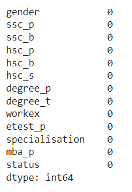
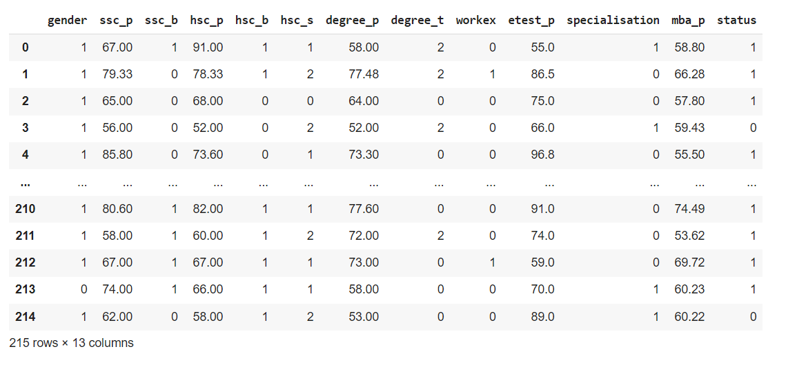
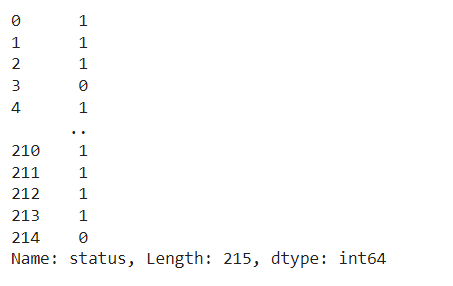
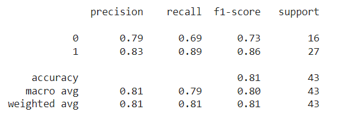

# Implementation-of-Logistic-Regression-Model-to-Predict-the-Placement-Status-of-Student

## AIM:
To write a program to implement the the Logistic Regression Model to Predict the Placement Status of Student.

## Equipments Required:
1. Hardware – PCs
2. Anaconda – Python 3.7 Installation / Jupyter notebook

## Algorithm
1. Import the required libraries.
2. Load the dataset and check for null data values and duplicate data values in the dataframe.
3. Import label encoder from sklearn.preprocessing to encode the dataset.
4. Apply Logistic Regression on to the model.
5. Predict the y values.
6. Calculate the Accuracy,Confusion and Classsification report.

## Program:
Program to implement the the Logistic Regression Model to Predict the Placement Status of Student.
# Developed by: SAKTHISWAR S
# RegisterNumber:  212222230127

```python
import pandas as pd
data = pd.read_csv("/content/Placement_Data (1).csv")
data.head()

data1 =data.copy()
data1 = data1.drop(["sl_no","salary"],axis = 1)
data1.head()

data1.isnull().sum()

data1.duplicated().sum()

from sklearn.preprocessing import LabelEncoder
le=LabelEncoder()
data1["gender"]=le.fit_transform(data1["gender"])
data1["ssc_b"]=le.fit_transform(data1["ssc_b"])
data1["hsc_b"]=le.fit_transform(data1["hsc_b"])
data1["hsc_s"]=le.fit_transform(data1["hsc_s"])
data1["degree_t"]=le.fit_transform(data1["degree_t"])
data1["workex"]=le.fit_transform(data1["workex"])
data1["specialisation"]=le.fit_transform(data1["specialisation"] )
data1["status"]=le.fit_transform(data1["status"])
data1

x = data1.iloc[:,:-1]
x

y = data1["status"]
y

from sklearn.model_selection import train_test_split
x_train,x_test,y_train,y_test=train_test_split(x,y,test_size=0.2,random_state = 0)

from sklearn.linear_model import LogisticRegression
lr = LogisticRegression(solver = "liblinear")
lr.fit(x_train,y_train)
y_pred = lr.predict(x_test)
y_pred

from sklearn.metrics import accuracy_score
accuracy = accuracy_score(y_test,y_pred)
accuracy

from sklearn.metrics import confusion_matrix
confusion = confusion_matrix(y_test,y_pred)
confusion

from sklearn.metrics import classification_report
classification_report1 = classification_report(y_test,y_pred)
print(classification_report1)


lr.predict([[1,80,1,90,1,1,90,1,0,85,1,85]])


```

## Output:











## Result:
Thus the program to implement the the Logistic Regression Model to Predict the Placement Status of Student is written and verified using python programming.
